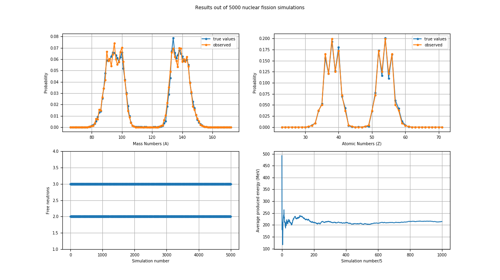
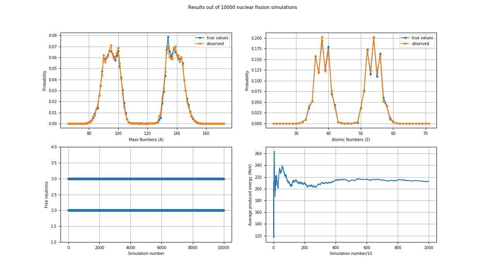
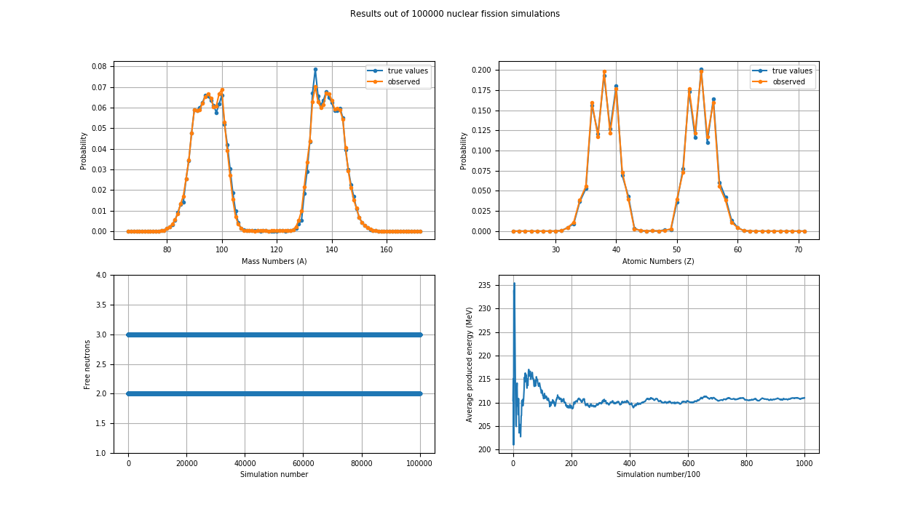
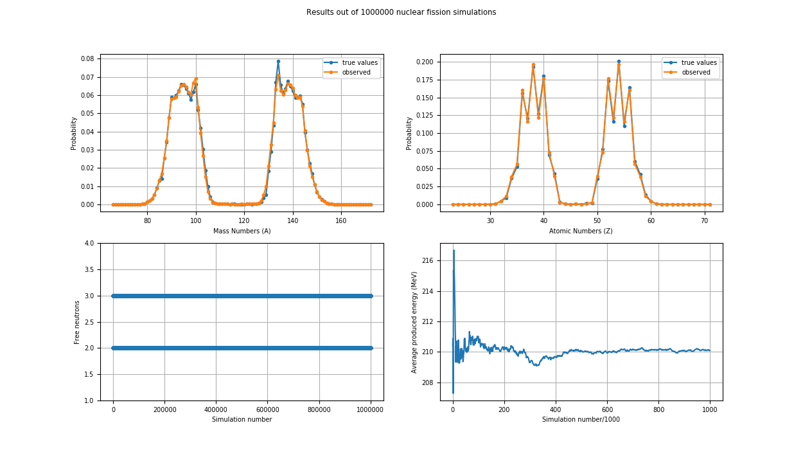

# NuclearFissionSimulation

Simulation of Uranium-235 nuclide fission.

## Requirements

To build and run this simulator you need:
    
    python2.7 or higher
    matplotlib
    cmake
    g++

## Build Instructions

    git clone https://github.com/alexfoglia1/NuclearFissionSimulator.git
    cd NuclearFissionSimulator
    mkdir build
    cd build
    cmake ..
    make

## Notes

Developed on a Ubuntu Machine. In order to build in Windows, Visual Studio 2015 is required.

## Credits

Fissile nuclides yield distributions are available [here](https://wwwndc.jaea.go.jp/cgi-bin/FPYfig).

Libraries:

JENDL-4.0 Fission Yield Sublibrary [J40-2010]

JENDL FP Fission Yields Data File 2011 [FPY-2011]

## Reports

### N = 1000

### N = 5000

### N = 10000

### N = 50000

### N = 100000

### N = 1000000

